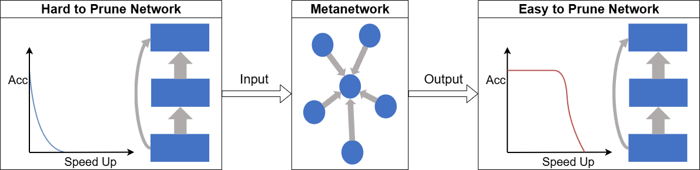
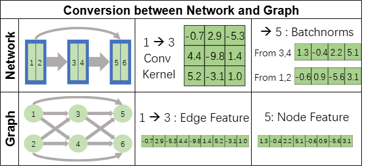

# 📄 Meta Pruning via Graph Metanetworks : A Universal Meta Learning Framework for Network Pruning




**[Basic info]**  
*Authors: [Yewei Liu], [Xiyuan Wang], [Muhan Zhang]*  
<!--*Conference/Journal: [e.g., NeurIPS 2025, arXiv preprint]* --> 
<!--*Arxiv : [[Arxiv Link](https://arxiv.org/abs/2506.12041)]* -->
<!-- *Published Version: [insert DOI or link if available]* -->

## 🔍 Overview

This repository contains the codes for our paper. You can reproduce our work or easily add other experiments based on our framework.

We have referenced the [Depgraph](https://github.com/VainF/Torch-Pruning) and [NGGNN](https://github.com/mkofinas/neural-graphs) codebases in part for our implementation. Thanks 😊.

Conversion Between Network and Graph:



Meta-Training Pipeline:


---

## 🚀 Getting Started

- git clone or download our code
- create the conda env using (1) or (2)

(1) main (change the cuda version as you need)
```bash
conda create -n MetaPruning python=3.9 -y
conda activate MetaPruning
conda install pytorch==2.5.1 torchvision==0.20.1 torchaudio==2.5.1  pytorch-cuda=11.8 -c pytorch -c nvidia -y
conda install pyg==2.3.0 pytorch-scatter -c pyg -y
pip install torch_geometric==2.3.0
pip install hydra-core einops opencv-python 
pip install torch-pruning 
pip install datasets 
pip install importlib_metadata
pip install termcolor
pip install h5py
```

(2) main_imagenet (change the cuda version as you need)
```bash
conda create -n MetaPruning python=3.9 -y
conda activate MetaPruning
pip install torch==2.5.1 torchvision==0.20.1 torchaudio==2.5.1 --index-url https://download.pytorch.org/whl/cu118
pip install torch_geometric
pip install pyg_lib torch_scatter torch_sparse torch_cluster torch_spline_conv -f https://data.pyg.org/whl/torch-2.4.0+cu118.html
pip install hydra-core einops opencv-python 
pip install torch-pruning 
pip install datasets 
pip install importlib_metadata
pip install termcolor
pip install h5py
```

- After finishing (1) or (2), install our package
```bash
cd MetaPruning
pip install -e .
```

---


## 📁 Directory Structure

```
.
├── data_loaders/           # Get data loaders for datasets and data models
├── generate_dataset/       # Generate data models
├── main/                   # Experiment on CIFAR10 & CIFAR100 (no parallel)
├── main_imagenet/          # Experiment on ImageNet (with parallel)
├── nn/                     # Graph Neural Networks
├── utils/                  # Utility Functions
│   ├── imagenet_utils/     # Utility Functions for ImageNet from DepGraph
│   ├── convert.py/         # Conversions between networks and graphs
│   ├── meta_train.py       # Meta train (eval) our metanetwork
│   ├── pruner.py           # Get a pruner
│   ├── pruning.py          # Several different ways of pruning
│   ├── train.py            # Train (eval) our network
│   ├── visualize.py        # Visualize "Test Acc VS. Speed Up" curve
│   └── ...          
└── README.md               # You are here!
```

---


## 🧪 Usage

See ['main/README.md'](main/README.md) for our implementation on small datasets without parallel (ResNet56 on CIFAR10, VGG19 on CIFAR100, etc.)

See ['main_imagenet/README.md'](main_imagenet/README.md) for our implementation on big datasets with data parallel (ResNet50 on ImageNet, ViT on ImageNet)


---


